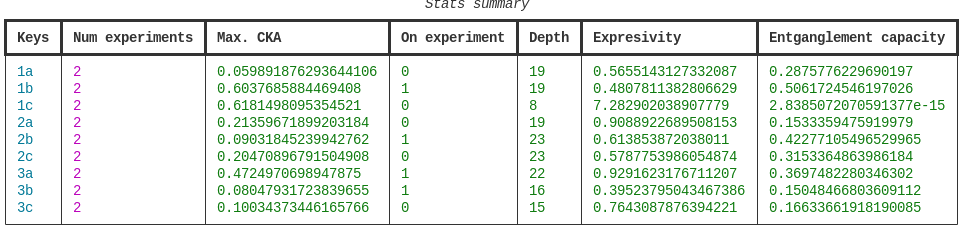

# Kernel trainer

A clean version of the module used to find the most performant quantum kernel configuration. A simple Python library that performs required execution given a set of data. Data can also be generated according to what was described in the paper for 3-dimensional examples belonging to three different families of data (0, 1a,1b,1c,2a,2b,2c,3a,3b,3c). It also allows for some known datasets like `iris` or `wine`.

Examples can be found under _notebooks_ folder.

## CLI usage

This library also allows for CLI access by specifying the corresponding parameters.

For data generation:
```py
ktrainer generate 
    --file-path file.csv
    --dataset-id 1a
    --samples 300
    --imbalance-ratio 0.1
```

Once the file is created, search of the best kernel can be triggered as follows:
```py
ktrainer search 
    --dataset file.csv or dataset name
    --dims 3
    --mode raw
    --generations 100
    --population 1000
    --chain-size 20
    --mutpb 0.05
    --cxpb 0.5
    --processes 15 
    --out-path out
```
> [!TIP]
> [Taskfile](https://taskfile.dev/) exists with default parameters so you can simply call:
>
> $> task generate:1a
>
> $> task search -- --dataset 1a

Two other functionalities have been added to benchmark and compare results. First option points to the obtained results from the `search` command and loads all existing pickle (.pkl) files inside the folder to get the stats up to now.

```py
ktrainer stats 
    --file-path <results_folder>/
```

It shows a table with the statistics for expressivity, entanglement capacity and CKA for each dataset id within the ones created by `generate` command. If `--id` is also provided looks for the ones specific to that id.



The benchmark subcommand, takes an individual dataset id from its original dataset file and compares the obtained best individual against classical and pre-fixed quantum kernels.
```py
ktrainer benchmark 
    --dataset file.csv
    --dims 3
    --mode raw
```
A stats summary table will appear at the end for a particular dataset and best found individual labeled as `best`.


## Task

[Taskfile](https://taskfile.dev/) allows for simpler execution just by calling `task search`. Make sure you follow with `-- `and your arguments to pass them by.

## Remote execution

For remote execution check out the [SkyPilot](https://docs.skypilot.co/en/latest/) template under _/scripts_ folder. A task command was added to ease the access

```sh
task launch -- scripts/<YOUR_SKY_YAML>
```